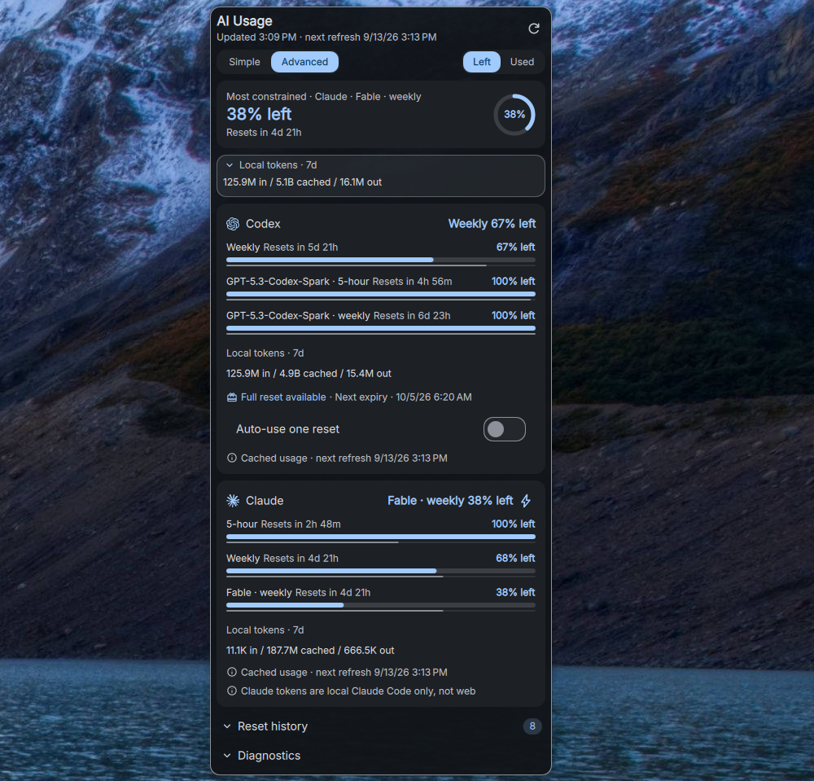
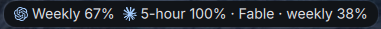

# DankAIUsage

DankAIUsage is a [DankMaterialShell](https://github.com/AvengeMedia/DankMaterialShell)
widget for Codex and Claude subscription quotas, extra-usage credits, and local
token history. A small Go helper collects usage for the widget.





## Why this plugin?

Choose DankAIUsage when you mainly use Codex and Claude and want a quota widget
without installing a separate third-party usage-monitoring application or
running a proxy service. Keeping the dependency footprint small is a design
goal: this repository maintains both the DMS widget and its small Go helper,
using the provider CLIs and their existing local sign-ins.

It brings their remaining allowances together, with local token history
available in the same dropdown.
It displays the limits each provider reports, including model-scoped windows,
Claude extra-usage credits, and available Codex resets with their expiry.
Left/Used and bar controls let you adjust the view while checking your usage.

The scope is deliberately two providers. The Go helper uses the local Codex
app server and Claude sign-in; it also exposes a JSON summary for terminal use.
Install that helper alongside the widget, plus `sqlite3` if you want Codex local
token history. This is not a dependency-free plugin: it avoids an additional
quota application, rather than eliminating the helper or provider CLIs.
Token history covers local CLI
activity, so it is not a complete account activity ledger. Claude prime is an
optional session-scheduling feature that consumes usage and is off by default.

### Similar plugins

Several registry plugins cover overlapping needs. Used/remaining views,
provider logos, and configurable bar values are shared features, not exclusive
to DankAIUsage. The dependency distinction is clearest against
[CodexBar](https://github.com/zakstam/dms-codexbar#readme), which wraps the separate
CodexBar CLI, and [CLIProxyAPI Quota](https://github.com/SpyrosPsarras/dms-cliproxy-quota#readme),
which requires a CLIProxyAPI server with pi-bridge. Other plugins also use local
provider sign-ins directly, so this is not a claim of fewer dependencies than
every alternative. These options are worth considering for different setups:

| Plugin | When it may fit your workflow |
|---|---|
| [AI Quotas](https://github.com/agneswd/dms-ai-quotas#readme) | You want additional providers and balances, with per-limit pinning and a used/remaining toggle. |
| [AiOverviewControl](https://github.com/bernardopg/AiOverviewControl#readme) | You want a broader provider dashboard with quota notifications, usage analytics, and history export. |
| [Claude Usage](https://github.com/bogdan-velicu/DankClaudeUsage#readme) | You want a focused Claude limit display with rings or numbers and support for existing Claude Code or OpenCode sign-ins. |
| [Claude Code Usage](https://github.com/titeya/dms-claudecode#readme) | You want Claude pacing, daily activity charts, profile breakdowns, and estimated API costs. |
| [CodexBar](https://github.com/zakstam/dms-codexbar#readme) | You already use the CodexBar CLI and want its quota output in DMS. |
| [CLIProxyAPI Quota](https://github.com/SpyrosPsarras/dms-cliproxy-quota#readme) | You want to monitor accounts behind a CLIProxyAPI server running pi-bridge. |

These comparisons describe the linked projects' documentation as reviewed in
September 2026; check their current documentation for changes.

## Features

The main display is a provider-defined list of quota bars rather than a fixed
session/weekly grid. Codex may expose its general subscription allowance
as a weekly-only window alongside separate model-scoped limits. Claude exposes five-hour,
weekly, model-scoped, and extra-usage credit limits. Missing buckets are omitted
instead of inferred from their position in an API response. Token totals are
kept as a secondary detail. Cached tokens are excluded from displayed totals by
default because Claude Code can attach large cached prompt/context blocks to
very small requests; enable "Include cached tokens" when you want to inspect
that overhead.

The top bar uses provider logos. Claude's five-hour, weekly, and extra-usage
credit values can each be enabled independently in plugin settings; these
choices do not remove any quota bars from the dropdown. Compact mode retains
one selected quota for each enabled provider rather than hiding a provider.
The generic plugin icon and provider logos are independently configurable, so
the bar can show either icon style, both styles, or text only.

Use **Left / Used** in the dropdown to switch all quota percentages and progress
bars together, including credits. Left is the default: 26% left fills 26% of the
bar; Used shows 74% used and fills 74%. Credit details show the remaining balance
or spending against the budget. Warning colors always reflect proximity to the
limit, regardless of display mode.

## Installation

Install the plugin files in
`~/.config/DankMaterialShell/plugins/DankAIUsage/`, then enable **AI Usage** in
DMS plugin settings and add it to your bar. The widget also needs the
`dankaiusage` helper on the DMS process's `PATH`; copying the QML files alone
does not install the helper.

### Nix

Build the helper from this checkout with `nix build`, or install the released
source with:

```sh
nix profile install github:alcxyz/DankAIUsage/main
```

For a declarative setup, install the helper and plugin source together from
the same pinned revision. This repository exposes `packages.<system>.default`
for the helper; use the source directory for your DMS plugin configuration.
The maintained `dms-plugins` aggregate exports this source as `srcs.aiusage`.

### Manual

With Go 1.22 or newer, build and install the helper from this checkout:

```sh
go build -o dankaiusage ./cmd/dankaiusage
install -Dm755 dankaiusage ~/.local/bin/dankaiusage
```

Copy `plugin.json`, `DankAIUsageWidget.qml`, `DankAIUsageSettings.qml`, and
`assets/` into the plugin directory above. Ensure `~/.local/bin` is on the
shell's `PATH` before starting DMS.

### Provider setup

- Install and sign in to the CLI for each provider you enable: Codex, Claude
  Code, or both. Disable providers you do not use in plugin settings.
- Install `sqlite3` for Codex local token history. Subscription percentages
  come from the provider and do not depend on token-history totals.
- Claude prime is off by default. Enabling it makes small model requests that
  consume usage to start session windows; it is not required to display quotas.

### One-shot Codex reset

The Codex dropdown includes **Auto-use one reset**, off by default. Turning it
on selects the earliest-expiring available reset with a known ID and expiry.
It waits until general Codex usage reaches 99%, or until ten minutes before
that reset expires with some general allowance used in a window whose natural
reset time is known and still in the future. It avoids the 99% trigger
when a natural quota reset is already within ten minutes. Spark usage alone
does not trigger it.

The control turns off before its single redemption attempt, including if that
attempt fails. After an uncertain result, check Codex's usage page before
arming again. It never purchases credits or chooses another reset silently.
Only the provider decides whether a window is eligible to reset.

Checks run once per minute while DMS is running and Codex is visible. Sleeping,
closing DMS, hiding Codex, or losing connectivity can miss the expiry; there is
no separate background service. The timing balances retained allowance against
a small safety margin, rather than guaranteeing the last possible moment.

The helper owns the state, so restarting DMS does not forget an armed reset and
multiple widget instances cannot independently redeem it. Terminal controls:

```sh
dankaiusage codex-reset status
dankaiusage codex-reset arm
dankaiusage codex-reset disarm
```

Requires a Codex CLI exposing the documented
[earned-reset app-server method](https://learn.chatgpt.com/docs/app-server#8-earned-rate-limit-resets-chatgpt).
Unsupported helpers or CLI versions show an error rather than using an
undocumented endpoint.

### Why does Spark have two bars?

Spark has [separate usage limits](https://learn.chatgpt.com/docs/agent-configuration/speed#codex-spark).
When Codex reports both five-hour and weekly Spark windows, the plugin shows
both, independently of the general Codex allowance. These are live provider
buckets, not hardcoded legacy quotas. A window disappears when the provider
stops reporting it; identical percentages alone do not make two windows duplicates.

## Settings

Plugin settings control the refresh interval (five minutes by default), token
history period, enabled providers, cached-token totals, and compact mode.
The dropdown's **Bar controls** also offers immediate toggles for compact mode,
provider logos, the plugin icon, and Claude session/weekly/credits selection.
These controls save the same preferences as the plugin settings menu and do
not need a data refresh. The Left / Used choice is saved as well.
Under **Top bar: icons**, choose the plugin icon, provider logos, both, or
neither. Under **Top bar: Claude quotas**, select session, weekly, and credits
independently. All available quotas remain visible in the dropdown.

## Troubleshooting

If Claude quotas disappear, run `claude auth status`. If signed out, run
`claude auth login`. The helper backs off briefly after authentication errors;
after the retry window expires, click Refresh in the dropdown or wait for the
next automatic refresh. Restarting DMS is not required after signing in.

If the widget cannot run its helper, check `dankaiusage version` from the same
environment as DMS. For Nix installations, ensure the helper and plugin files
come from the same revision. `dankaiusage summary --pretty` reports provider
diagnostics under `meta`; a provider being available means its CLI is present,
not necessarily that its account is signed in.

## Data sources

- Codex limits: queries the local Codex app server with
  `account/rateLimits/read`. Windows are classified by their returned duration,
  and available banked resets are shown with their expiry. Apply a reset from
  Codex **Settings → Usage**, or explicitly arm the one-shot control above.
- Claude limits: queries Anthropic's OAuth usage endpoint using the local
  Claude Code sign-in (see
  [ADR-0001](docs/adr/ADR-0001-claude-limits-from-oauth-usage-api.md)).
  The helper prefers the structured `spend` object for extra-usage credits and
  falls back to `extra_usage`, deduplicating both into one monetary quota bar.
  The statusline JSON cached by `dankaiusage claude-statusline` is the
  fallback source.
- Token history: reads Codex `logs_2.sqlite` and Claude project JSONL
  transcripts from their normal CLI config locations. Claude token totals are
  local Claude Code history only; usage from claude.ai, mobile, or other online
  surfaces is not written to those transcripts and is not exposed through a
  Claude CLI usage command.
- CLI availability: reports whether `codex`, `claude`, and `sqlite3` are on
  `PATH`.

For Claude limits the helper reads the Claude Code OAuth token from
`~/.claude/.credentials.json` itself, uses it only for the usage request, and
never prints or logs it. Everything it emits is aggregate local usage and
subscription-window percentages.

## Claude statusline (fallback)

Claude Code passes statusline commands a JSON snapshot on stdin. This is the
fallback limit source for setups where the usage endpoint is unavailable
(for example macOS installs keeping credentials in the Keychain). Configure it
to let DankAIUsage cache the rate-limit data without making extra model calls:

```json
{
  "statusLine": {
    "type": "command",
    "command": "dankaiusage claude-statusline",
    "padding": 0
  }
}
```

The cache is written to
`$XDG_STATE_HOME/dankaiusage/claude-statusline.json`, or
`~/.local/state/dankaiusage/claude-statusline.json` when `XDG_STATE_HOME` is
unset.

The statusline payload is produced by Claude Code after an interactive API
response. If the cache does not exist yet, open Claude Code in a trusted
workspace and send one message so Claude Code can pass fresh account limit data
to `dankaiusage claude-statusline`.

Claude prime deliberately starts a Claude subscription window with one tiny
request. Originally a statusline-era limit workaround (see
[ADR-0006](docs/adr/ADR-0006-opt-in-claude-prime.md)), it is now useful as a
window scheduler: if you reliably use up every 5-hour window, auto-priming
starts the next window's countdown as soon as the previous one closes instead
of waiting for your next real request (see
[ADR-0007](docs/adr/ADR-0007-auto-prime-as-window-scheduler.md)).

```sh
dankaiusage claude-prime
```

The command refuses to run unless the statusline command is configured. It
skips without spending anything when account usage data already shows an
active session window, when a prime ran within the last 15 minutes, or — if
account data is unavailable — while the local prime timer is active.
Otherwise, it sends one small `claude -p` prompt with safe mode, no
session persistence, tools disabled, a tiny replacement system prompt, `sonnet`
as the default model, prompt suggestions disabled, and a low budget cap. It
then refreshes the account usage cache and returns the new window's
allowances, and records a local five-hour session timer as the fallback
guard. This spends a small amount of Claude usage by design.

When the "Enable Claude prime" setting is on, the widget automatically runs the
prime request whenever Claude is visible and no active session timer is known.
Any current local Claude session with a future reset time prevents another
automatic prime until that timer expires. After a successful prime, the cached
five-hour session timer provides that reset time even when Claude statusline
does not publish account limits. If an automatic prime fails without producing
local usage, the widget does not keep retrying; use the Claude bolt or toggle
the setting off and on to try again.

## Build

```sh
nix build
```

or:

```sh
go build ./cmd/dankaiusage
```

## Usage

```sh
dankaiusage summary --period-days 7 --pretty
```

The widget polls that command and caches the last successful summary in DMS
plugin state so the bar can render immediately after shell restart.
