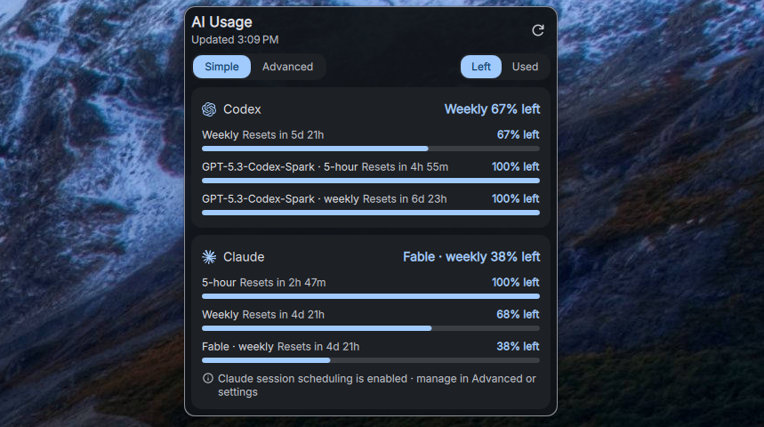

# DankAIUsage

A [DankMaterialShell](https://github.com/AvengeMedia/DankMaterialShell) widget
for Codex and Claude subscription quotas, extra-usage credits, and local token
history. A small Go helper (`dankaiusage`) collects the data using the
provider CLIs and their existing local sign-ins. No proxy, no extra
monitoring app.





## What you get

- **Every limit the provider reports**, as a list of quota bars: Codex weekly
  and model-scoped windows, Claude five-hour, weekly, model-scoped, and
  extra-usage credits. Nothing is inferred from position in a response.
- **Reset countdowns** inline on each row, exact time on hover, and colors
  that turn to warning at 25% and error at 10% remaining.
- **Simple or Advanced** dropdown, remembered. Advanced adds an overview,
  local token history with an optional persistent tracked total, available
  Codex resets, reset history, and diagnostics.
- **Top bar** with provider logos and the quotas you choose; percentages
  take the same warning colors.
- **Left / Used** switch for all percentages and bars at once.
- **Opt-in automation**: a one-shot Codex reset that fires once near expiry
  or exhaustion, and Claude prime as a session-window scheduler. Both are off
  by default.
- **Local reset history** with an optional "What changed?" prompt, and an
  optional, alpha-quality public reset feed.

The scope is deliberately two providers. Token history covers local CLI
transcripts only, so it is not a complete account ledger. Subscription
percentages come from the providers, never from token estimates.

## Install

The widget needs both the plugin files and the `dankaiusage` helper on the DMS
process's `PATH`.

**Nix**

```sh
nix profile install github:alcxyz/DankAIUsage/main
```

For a declarative setup, this flake exposes `packages.<system>.default` for
the helper; use the source directory as the DMS plugin. The maintained
`dms-plugins` aggregate exports it as `srcs.aiusage`.

**Manual** (Go 1.22 or newer)

```sh
go build -o dankaiusage ./cmd/dankaiusage
install -Dm755 dankaiusage ~/.local/bin/dankaiusage
```

Copy `plugin.json`, `DankAIUsageWidget.qml`, `DankAIUsageSettings.qml`, and
`assets/` into `~/.config/DankMaterialShell/plugins/DankAIUsage/`. Make sure
`~/.local/bin` is on the shell's `PATH` before starting DMS.

Then enable **AI Usage** in DMS plugin settings and add it to your bar.

## Set up providers

1. Install and sign in to the CLI for each provider you use: `codex`,
   `claude`, or both.
2. Disable the provider you do not use under **Settings → Plugins → AI
   Usage**.
3. Optional: pick which Claude quotas appear in the top bar, and the refresh
   interval (default five minutes).

If Claude quotas disappear later, run `claude auth status` and sign in again
if needed; the widget recovers on its next refresh.

## Learn more

| Topic | Read |
|---|---|
| Reading the dropdown: modes, quota bars, countdowns, local tokens, tracked totals | [docs/dropdown.md](docs/dropdown.md) |
| Plugin settings, top-bar layout, Claude quota selection | [docs/settings.md](docs/settings.md) |
| One-shot Codex reset | [docs/codex-reset.md](docs/codex-reset.md) |
| Reset history, explaining changes, public announcements (Alpha) | [docs/reset-history.md](docs/reset-history.md) |
| Where the numbers come from, refresh cooldown, Claude statusline fallback, Claude prime | [docs/data-sources.md](docs/data-sources.md) |
| Troubleshooting and local diagnostics | [docs/diagnostics.md](docs/diagnostics.md) |
| Helper CLI reference | [docs/cli.md](docs/cli.md) |
| Similar plugins and when they fit better | [docs/similar-plugins.md](docs/similar-plugins.md) |
| Anecdotal usage tips | [docs/usage-tips.md](docs/usage-tips.md) |
| Design decisions | [docs/adr/README.md](docs/adr/README.md) |

## Privacy in one paragraph

The helper reads provider sign-ins locally and never prints credentials.
Everything the widget stores is local and bounded: quota snapshots, reset
observations, optional explanations, hashed token checkpoints, and a
diagnostics log with no raw errors or identifiers. The only optional network
call beyond the two providers is the public reset feed, which is off by
default.

## License

[MIT](LICENSE)
